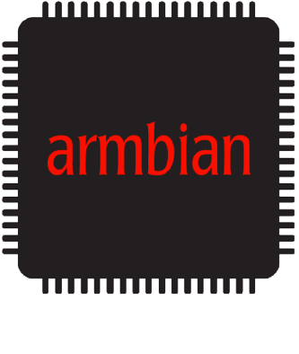

<h3 align=center><a href="#armbian-build-tools"></a><br>
auto testing</h3>

# TL;DR
Script can be installed on any Debian based Linux device on your network. Adapt the configuration-file to your requirements, start the test procedure and wait until its done. Check the logs/ for errors and summary in /reports


## Privacy concerns
It runs locally in your network, no data is sent anywhere. Icons come from the internet.


# Getting started

Clone, edit userconfig/configuration.sh and run the script. Script will scan your local network (if SUBNET is defined) otherwise it will cycle on IPs you have defined in HOSTS variable.

It will create logins based on the configuration file and run different tests/ to see if the board is working properly. You can start with predefined credentials or use your own.

All you need to do is configure the configuration file, hook up the power and network cable and you are ready for running the test.

That's it.

## Prerequisites

Download the latest armbian image for your board(s). We recommend to use .torrent because this does the file integrity check for you automatically. [Write the data to the SDcard](https://docs.armbian.com/User-Guide_Getting-Started/#how-to-prepare-a-sd-card)

Put the SDcard into your device, power it up and let it sit for 1-2 minutes, to do the standard initial setup.

## Prepare your system

1. Go to a folder where you want to store it. The following command will create a folder called 'autotests'. Clone the sources from Github and open the folder autotests:
```
apt install git
git clone https://github.com/armbian/autotests
cd autotests
./go.sh
```
 
2. Edit `lib/configuration.sh`  
	- change number of passes (optional)
	- change stress time in seconds (optional)  

What is your device(s) IP-Address or do you have a dedicated subnet for your devices.
To find the device, check your router or use [this tool](http://angryip.org/), to find your boards IP-Address(es).
	- set IP-Address (HOSTS) or Subnet (Examle: 192.168.0.1/24)
	- set WLAN_SSID and password (2,4 and/or 5,0GHz)
	- set BLUEDEV MAC-Address of a Blueooth device (Android phone for example)

How to find the Bluetooth MAC-Address on your mobile or Linux device with BT? Put your phone's BT to discoverable mode and run:

`hcitool scan` 

on a Linux computer that has a BT-Dongle. On an Android device you find the MAC-Address in the phones settings/about the phone/Status.

3. Run :+1: :
The script will display which board gets tested
```
./go.sh
```
4. Once finished, go to `/autotests/logs` and check latest report.`


# What this tool does?

It Connects to the host(s) or all Armbian hosts in your subnet and runs the tests found in folder tests in alphabetical order.

Example report:

<table cellspacing=0 width=100% border=1><tr><td align=right rowspan=2>#</td><td align=center rowspan=2>Board<br>/<br>Cycle</td><td rowspan=2>Version / distribution <br>Kernel / variant</td>
<td align=center rowspan=1><br><small>Lan</small></td><td align=center rowspan=1><br><small>2.4Ghz</small></td><td align=center rowspan=1><br><small>5Ghz</small></td><td align=center rowspan=1><br><small>memory</small></td><td align=center rowspan=1><br><small>storage</small></td><td align=center rowspan=2><br><small></small></td><td align=center rowspan=2><br><small>Stress 2s</small></td><td align=center rowspan=2><br><small>DVFS (Mhz)</small></td></tr><tr><td align=middle colspan=3>Iperf send/receive (MBits/s)</td><td align=middle colspan=2>IO read/write (MBits/s)</td></tr>

<tr><td align=right rowspan=3>1</td><td colspan=10>Odroid XU4 ###.###.###.210</td></td></tr><tr><td align=center>1/2<br><small>22:52:45</small></td><td>20.02.1 (buster)<br>Linux 5.4.19-odroidxu4 stable</td><td align=center><small>r8152</small><br> 894 - 919<br></td><td align=center><small>rtl88x2bu</small><br>104<br></td><td align=center><small>rtl88x2bu</small><br>161<br></td><td align=center>745 - 754</td><td align=center>845 - 23</td><td align=center></td><td align=center></td><td align=center>600 - 1400</td></tr>

<tr><td align=center>2/2<br><small>23:05:33</small></td><td>20.02.1 (buster)<br>Linux 5.4.19-odroidxu4 stable</td><td align=center><small>r8152</small><br> 900 - 913<br></td><td align=center><small>8188eu</small><br>8<br><small>rtl8821cu</small><br>5<br><small>rtl88xxau</small><br>4<br></td><td align=center><small>rtl8821cu</small><br>81<br><small>rtl88x2bu</small><br>66<br></td><td align=center>729 - 719</td><td align=center>821 - 23</td><td align=center></td><td align=center></td><td align=center>600 - 1400</td></tr>

<tr><td align=right rowspan=3>2</td><td colspan=10>RockPi-4B ###.###.###.217</td></td></tr><tr><td align=center>1/2<br><small>23:13:32</small></td><td>20.02.1 (buster)<br>Linux 5.4.26-rockchip64 stable</td><td align=center><small>rk_gmac-dwmac</small><br> 929 - 913<br></td><td align=center></td><td align=center></td><td align=center>1658 - 1624</td><td align=center>1601 - 69</td><td align=center></td><td align=center></td><td align=center>600 - 1512</td></tr>

<tr><td align=center>2/2<br><small>23:19:35</small></td><td>20.05.0-trunk.082 (buster)<br>Linux 5.4.27-rockchip64 nightly</td><td align=center><small>rk_gmac-dwmac</small><br> 791 - 858<br></td><td align=center><small>brcmfmac</small><br>82<br></td><td align=center><small>brcmfmac</small><br>193<br></td><td align=center>1637 - 1595</td><td align=center>1617 - 69</td><td align=center></td><td align=center></td><td align=center>600 - 1512</td></tr>
</table>

# Which tests are executed?

| test name | function |
|:-|:-|
|0000-read-board-data.bash| Read board OS information|
|0001-nigtly-stable-switch.bash| Switching between nightly and stable, odd/even|
|0002-update-and-upgrade.bash| Upgrade all packages|
|0008-connect-wireless-devices-on-2.4Ghz.bash|Connects wireless devices on 2.4G band|
|0013-iperf-on-all-wired-interfaces.bash|Check speed on all wired devices|
|0014-iperf-on-all-wireless-interfaces.bash|Check speed on all wireless devices|
|0015-connect-wireless-devices-on-5.0Ghz.bash|Connects wireless devices on 5G band|
|0017-iperf-on-all-wireless-interfaces.bash|Check speed on all wireless devices|
|0018-io-tests-memory.bash| Determine maximum memory random write speed|
|0019-io-tests-drive.bash| Determine maximum SD/eMMC random write speed|
|0111-bluetoth.bash|Ping Bluetooth device to check basic BT functionality|
|0115-strong-stressing.bash|Running heavy stressing for n seconds|
|0116-dvfs.bash|Get min and max CPU temperature to see if DVFS is operational|
|0119-7-zip-benchmark.bash.disabled|Run 7Zip benchmark|
|9999-reboot.bash|Reboot the board|


## To do's:
- [ ] improve errors catching  
- [ ] create XML data export for single board and together  
- [ ] common data collecting  
- [ ] support custom test board https://forum.armbian.com/topic/10841-the-testing-thread  


